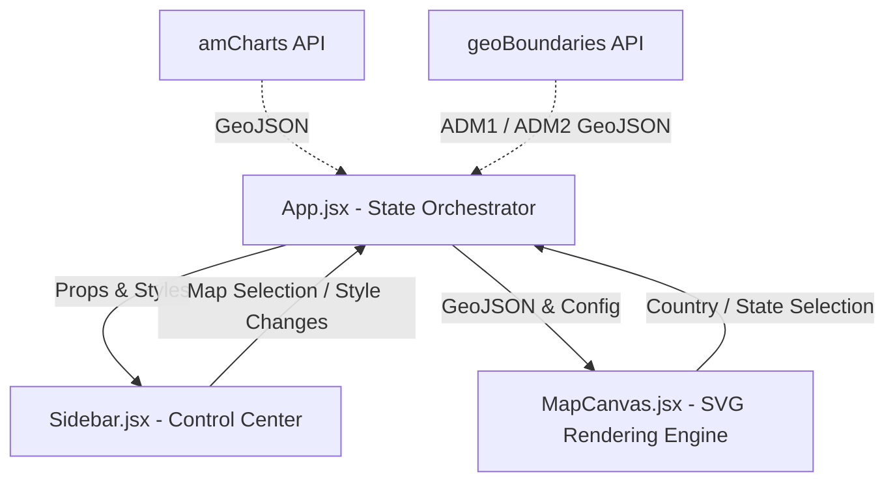
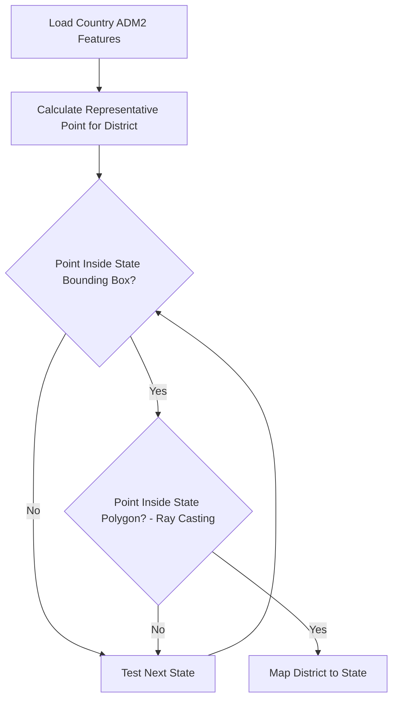

# 📐 SnapMap: Technical Architecture Specification

This document provides a comprehensive technical overview of the SnapMap design pattern, data pipelines, geometric coordinate algorithms, and core React/D3 integration layers.

---

## 1. System Architecture Overview

SnapMap is designed as a single-page application utilizing a **unidirectional React state workflow** with **D3.js** serving as the projection and vector rendering engine.



### Core Components
1. **`App.jsx` (State Orchestrator)**: Manages level hierarchies (World ➔ ADM1 ➔ ADM2), active projections, color settings, simplification thresholds, and coordinates API fetch pipelines.
2. **`Sidebar.jsx` (UI & Control Center)**: Houses configuration panels for projections, colors, path simplification sliders, label formatting, customized polygon lists, paint tool configurations, and download triggers.
3. **`MapCanvas.jsx` (Graphics Engine)**: Manages D3 SVG initialization, projections fitting, panning/zooming behaviors, mouse tooltips, click detections, and label centroid calculations.

---

## 2. Coordinate Winding Correction (`rewindGeoJSON`)

### The Winding Order Problem
A frequent issue with client-side SVG rendering of geographic vectors is the **Winding Order**.
- In standard cartography, **exterior rings** of polygons must follow a specific winding direction (e.g., clockwise in Cartesian systems), and **interior rings (holes)** must follow the opposite direction (counter-clockwise).
- If coordinates are wound in reverse order, D3’s SVG path generator (`d3.geoPath()`) interprets the coordinate bounds as covering the **entire sphere *except* the polygon**. This leads to a rendering failure where a massive, filled box covers the canvas.

### The Solution: Shoelace Signed Area
SnapMap implements `rewindGeoJSON` (found in [`geoUtils.js`](file:///Users/princepal_kpmg/Developer/Personal/SVG-Map-Generator/src/utils/geoUtils.js#L238-L291)) to sanitize and correct coordinates client-side prior to rendering.

For each polygon path ring:
1. **Compute Signed Area (Shoelace Formula)**:
   $$\text{Area} = \frac{1}{2} \sum_{i=0}^{n-1} (x_i y_{i+1} - x_{i+1} y_i)$$
   - A negative area indicates a clockwise winding order.
2. **Evaluate & Revert**:
   - If the ring is an **exterior boundary** (index 0) and is not clockwise, reverse the array of coordinates.
   - If the ring is an **interior boundary** (index > 0) and is not counter-clockwise, reverse the coordinates.

---

## 3. Client-Side Spatial Point-in-Polygon (ADM1 ➔ ADM2)

When a user drills down from country (ADM1) to state (ADM2) levels, the geoBoundaries API does not support querying districts for a *single state*. It returns the *entire country's* ADM2 feature set (often hundreds of polygons). To isolate and map districts to their parent state, SnapMap performs a **client-side point-in-polygon spatial join** in [`geoUtils.js`](file:///Users/princepal_kpmg/Developer/Personal/SVG-Map-Generator/src/utils/geoUtils.js#L75-L111).



### The Spatial Join Pipeline
1. **Representative Point Extraction**: Calculates the average coordinate of the district's primary outer boundary ring to form a test coordinate point.
2. **Bounding Box Pruning**: Before executing heavy intersection math, SnapMap compares the point against the bounding box `[minX, minY, maxX, maxY]` of each state. If the point falls outside the box, the state is pruned immediately.
3. **Ray-Casting Algorithm**: For the remaining candidates, a ray is projected horizontally from the point. If the ray intersects the state's polygon boundary an **odd number of times**, the point resides inside the state, completing the association.

---

## 4. Client-Side Geometry Simplification

To maintain smooth rendering performance and minimize vector weight on exports, SnapMap allows dynamic path simplification.

1. **Douglas-Peucker Algorithm**: Focuses on line segments, recursively subdividing a polyline and keeping coordinates that exceed a perpendicular distance tolerance.
2. **Visvalingam-Whyatt Algorithm (Planar & Spherical)**: Iteratively deletes coordinates that form the smallest triangle area with their neighbors. SnapMap defaults to **Spherical Visvalingam-Whyatt**, which scales longitude differences by the cosine of the latitude:
   $$\text{Area}_{\text{spherical}} = \text{Area}_{\text{planar}} \times \cos(\text{Latitude}_{\text{centroid}})$$
   This ensures polar shapes are not over-simplified relative to equatorial zones.

---

## 5. Adaptive Font Sizing

To prevent overlap and visual noise, the label layout engine in [`MapCanvas.jsx`](file:///Users/princepal_kpmg/Developer/Personal/SVG-Map-Generator/src/components/MapCanvas.jsx#L347-L371) uses boundary dimensions to size text dynamically.

1. **Centroid Coordinates**: Labels are drawn at the geographic centroid computed by D3:
   ```javascript
   const centroid = pathGenerator.centroid(feature);
   ```
2. **BBox Fit Constraints**:
   - Computes width (`dx`) and height (`dy`) of the boundary.
   - Calculates the maximum permissible font size to prevent overlapping boundaries:
     $$\text{Max Width} = \frac{dx \times 0.9}{\text{characters} \times 0.55}$$
     $$\text{Max Height} = dy \times 0.75$$
   - Takes the minimum of both bounds: $\text{Font Size} = \min(\text{Max Width}, \text{Max Height}, \text{Base Font Size})$.
3. **Visual Culling**: If the computed font size falls below **6.5px**, the label is automatically culled from the DOM to maintain readability.

---

## 6. Vector and Raster Export Engine

- **High-Res SVG Export**:
  - Clones the target `<svg>` element via `cloneNode(true)` to isolate it.
  - Sets width and height properties explicitly to `100%`.
  - Serializes the cloned element using the native browser `XMLSerializer` to output standard standalone SVG markup.
- **HD PNG Export**:
  - Captures the SVG string, converts it to an encoded `image/svg+xml` Blob, and loads it into an off-screen image element.
  - Uses an HTML5 `<canvas>` scaled by **2.0x** (Retina resolution) to render the background and paint the SVG onto the canvas.
  - Exports the canvas using `canvas.toBlob()` to produce a crisp raster download.
